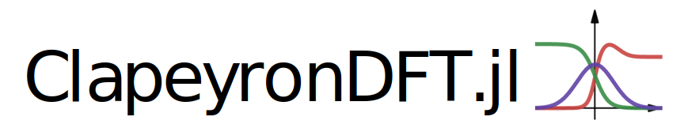

# cDFT.jl

[](https://github.com/ClapeyronThermo/cDFT.jl/actions/workflows/ci.yml)
[](https://clapeyronthermo.github.io/cDFT.jl/stable)
[](https://clapeyronthermo.github.io/cDFT.jl/dev)
[](LICENSE.md)

cDFT.jl provides a comprehensive, extensible library of classical Density Functional
Theory (cDFT) and Self-Consistent Field Theory (SCFT) models, as well as a simple
framework to develop your own. cDFT is built directly on top of
[Clapeyron.jl](https://github.com/ClapeyronThermo/Clapeyron.jl) and reuses its equations
of state as the bulk free-energy model underlying every inhomogeneous calculation — the
two packages are meant to be used together.

With cDFT you can compute density profiles, surface/interfacial tensions and adsorption
isotherms for fluids next to walls, in pores, around solutes, at vapour-liquid and
liquid-liquid interfaces, in microphase-separated copolymer melts, and for electrolytes
near surfaces — in 1D, 2D or 3D, on the CPU or GPU, and (via Dynamic DFT) as a function of
time as well as space.

## Installation

cDFT.jl is a registered package. Since every calculation needs a bulk equation of state,
you'll almost always want [Clapeyron.jl](https://github.com/ClapeyronThermo/Clapeyron.jl)
installed alongside it:

```julia
julia> using Pkg

julia> Pkg.add(["cDFT", "Clapeyron"])
```

See the [Installation](https://clapeyronthermo.github.io/cDFT.jl/dev/installation) page
for optional extensions (plotting, GPU, group-contribution connectivity, Dynamic DFT).

## Example usage

Currently, cDFT can be used to obtain surface and interfacial tensions for both pure and
mixture systems using, e.g., the PC-SAFT functional:

```julia
julia> using Clapeyron, cDFT

julia> model = PCSAFT(["water","octane"])
PCSAFT{BasicIdeal} with 2 components:
 "water"
 "octane"
Contains parameters: Mw, segment, sigma, epsilon, epsilon_assoc, bondvol

julia> interfacial_tension(model,1e5,298.15,[0.5,0.5])
0.05104399059834009
```

A lower-level example — the density profile of liquid methane next to a graphite wall:

```julia
using Clapeyron, cDFT

model = PCSAFT(["methane"])
T, p = 150.0, 1e7
v = Clapeyron.volume(model, p, T, [1.0]; phase=:liquid)
ρbulk = [1/v]
L = cDFT.length_scale(model)

width = 5L
surface = Steele(["graphite"], width)
structure = Uniform1DCart((p, T), ρbulk, [0.5L, width-0.5L], 201)

system = DFTSystem(model, structure, surface)
ρ = initialize_profiles(system)
converge!(system, ρ)
```

See [Getting Started](https://clapeyronthermo.github.io/cDFT.jl/dev/tutorials/getting_started)
for the full walkthrough, including plotting the result.

## Features

- **Many free-energy functionals** — PC-SAFT, PCP-SAFT (incl. quadrupolar and
  pharmaceutical variants), group-contribution/heterosegmented chains, SAFT-VR Mie,
  SAFT-γ Mie, COFFEE, PeTS, Density Gradient Theory, electrolytes and Self-Consistent
  Field Theory, all sharing Clapeyron.jl's equations of state as the underlying bulk
  model.
- **Flexible geometries** — planar, cylindrical, spherical and fully 3D structures, plus
  block-copolymer microphase morphologies (BCC, gyroid, hex, lamellar).
- **GPU acceleration** — the same model code runs unchanged on CPU or GPU via
  KernelAbstractions.jl and Enzyme.jl.
- **Dynamic DFT** — evolve density profiles in time as well as space, to watch phase
  separation and microphase ordering actually happen.

## Documentation

Full documentation, including tutorials and the API reference, is available at
[clapeyronthermo.github.io/cDFT.jl](https://clapeyronthermo.github.io/cDFT.jl/dev):

- [Installation](https://clapeyronthermo.github.io/cDFT.jl/dev/installation)
- Tutorials: [Getting Started](https://clapeyronthermo.github.io/cDFT.jl/dev/tutorials/getting_started),
  [Choosing a Geometry & Adsorption](https://clapeyronthermo.github.io/cDFT.jl/dev/tutorials/geometries),
  [Vapour-Liquid Interfaces](https://clapeyronthermo.github.io/cDFT.jl/dev/tutorials/vapor_liquid_interfaces),
  [Multi-Dimensional Interfaces](https://clapeyronthermo.github.io/cDFT.jl/dev/tutorials/multidimensional_interfaces),
  [Group-Contribution & Heterosegmented Chains](https://clapeyronthermo.github.io/cDFT.jl/dev/tutorials/group_contribution_chains),
  [Copolymer Microphase Morphologies](https://clapeyronthermo.github.io/cDFT.jl/dev/tutorials/copolymer_morphology),
  [Self-Consistent Field Theory](https://clapeyronthermo.github.io/cDFT.jl/dev/tutorials/scft),
  [Electrolytes](https://clapeyronthermo.github.io/cDFT.jl/dev/tutorials/electrolytes),
  [Dynamic DFT](https://clapeyronthermo.github.io/cDFT.jl/dev/tutorials/dynamic_dft),
  [GPU Acceleration](https://clapeyronthermo.github.io/cDFT.jl/dev/tutorials/gpu_acceleration)
- [Available Models](https://clapeyronthermo.github.io/cDFT.jl/dev/models/saft),
  [Structures](https://clapeyronthermo.github.io/cDFT.jl/dev/structures) and
  [External Fields](https://clapeyronthermo.github.io/cDFT.jl/dev/external_fields)
- [API reference](https://clapeyronthermo.github.io/cDFT.jl/dev/api/system)
- [FAQ](https://clapeyronthermo.github.io/cDFT.jl/dev/faq)

## Package in active development

Note that at its current stage, cDFT is still in the early stages of development, and
things may be moving around or changing rapidly, but we are very excited to see where
this project may go!

## Citing cDFT.jl

cDFT.jl does not yet have a dedicated publication — for now, please cite the
[GitHub repository](https://github.com/ClapeyronThermo/cDFT.jl) directly. Since every
cDFT calculation is built on top of a Clapeyron.jl bulk equation of state, please also
cite [Clapeyron.jl](https://pubs.acs.org/doi/10.1021/acs.iecr.2c00326) itself, along with
the specific equation of state used (obtainable via `Clapeyron.cite(model)`) and, where
relevant, the original cDFT functional reference (e.g. Sauer & Gross, 2017 for the
weighted-density PC-SAFT functional; see the
[Available Models](https://clapeyronthermo.github.io/cDFT.jl/dev/models/saft) docs for
each functional's reference).

## Related packages

- [Clapeyron.jl](https://github.com/ClapeyronThermo/Clapeyron.jl) — provides every bulk
  equation of state cDFT builds its inhomogeneous functionals on top of, and is required
  alongside cDFT for essentially all use.
- [GCIdentifier.jl](https://github.com/ClapeyronThermo/GCIdentifier.jl) — group
  contribution identification from SMILES, used for building heterosegmented and
  group-contribution cDFT models.
- [Langmuir.jl](https://github.com/ClapeyronThermo/Langmuir.jl) — single- and
  multi-component adsorption equilibrium models, complementary to cDFT's own adsorption
  isotherm calculations.

## Authors

- [Pierre J. Walker](mailto:pjwalker@caltech.edu), California Institute of Technology
- [Andrés Riedemann](mailto:andres.riedemann@gmail.com), University of Concepción

## License

cDFT.jl is licensed under the [MIT license](LICENSE.md).
