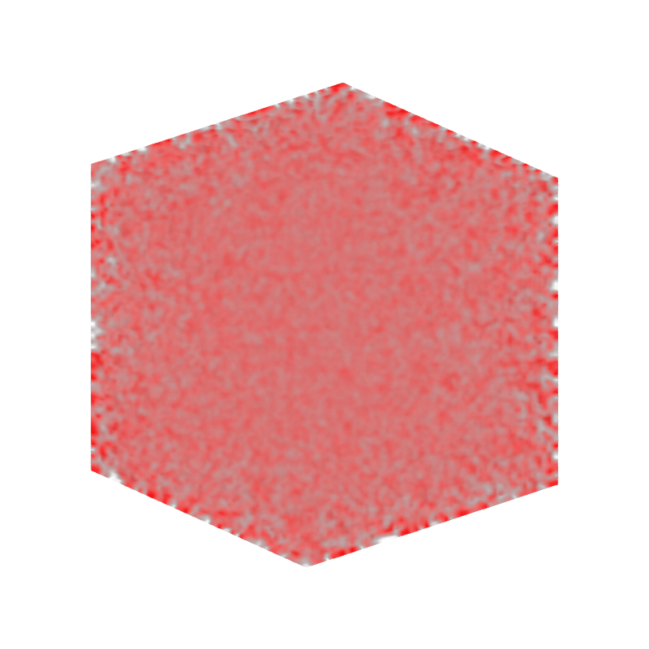
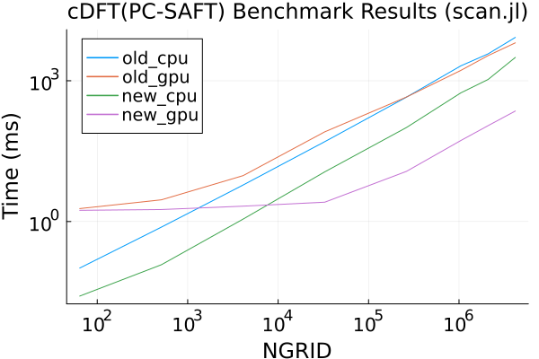

# GPU Acceleration of PC-SAFT Density Functional Theory

Zhuolin He, CCE, Caltech (zhe3@caltech.edu)

This project accelerates the core residual free-energy functional derivative (`δFδρ_res`) of the `cDFT.jl` package using GPUs. By offloading grid-wise Automatic Differentiation (AD) to the GPU, we eliminate the significant data transfer bottleneck between host and device, enabling high-performance 2D and 3D dynamic density functional theory (DDFT) simulations.

## Installation and Usage Instructions

### Dependencies
Ensure you have a CUDA-compatible GPU and the following Julia packages:
- `CUDA.jl`
- `Enzyme.jl`
- `Clapeyron.jl`
- `Plots.jl`
- `HDF5.jl`

### Running the Benchmarks
To compare the performance of CPU and GPU versions:
```bash
julia --project=. benchmark/scan.jl
```
This script generates `scan.txt` with timing data and correctness verification.

### Running Simulations
1. **2D Phase Separation**:
   ```bash
   julia --project=. benchmark/dynamic_dft_2d.jl
   julia --project=. benchmark/dynamic_dft_2d_viz.jl
   ```
2. **3D Simulations**:
   ```bash
   julia --project=. benchmark/dynamic_dft_3d.jl
   julia --project=. benchmark/dynamic_dft_3d_viz.jl
   ```

## Project Description and Features

### GPU-Native Functional Derivatives
The primary bottleneck in PC-SAFT DFT is the evaluation of the free energy density gradient at every grid point. Previous implementations relied on a **GPU-CPU-GPU** strategy, transferring weighted densities back to the CPU for evaluation. This project achieves **Native GPU Execution** through:

- **Enzyme-based Reverse AD**: Using `Enzyme.autodiff_deferred` within a GPU kernel to compute local gradients of the free energy density with respect to all weighted densities in parallel.
- **Lite GPU Kernels**: A streamlined, bitstype-safe version of the PC-SAFT free energy density optimized for GPU execution.
- **Zero-Copy Workflow**: All necessary buffers (weighted densities, gradients, and FFT buffers) are maintained in GPU memory, keeping the entire simulation loop on-device.

## Expected Results and Screenshots

### Simulation Visualizations
Below are the results for 2D phase separation (Vapor-Liquid Equilibrium) and a 3D trajectory evolution.

| 2D Phase Separation | 3D Trajectory Visualization |
| :---: | :---: |
|  |  |

## Performance Analysis

Benchmarks conducted on an NVIDIA RTX 2000 Ada Generation GPU show significant speedups as the grid size ($N$) increases. The "New GPU" implementation (using grid-wise Enzyme AD) outperforms both the original  CPU and the previous hybrid GPU-CPU-GPU implementations (old_cpu and old_gpu).



| NGRID | old_cpu (ms) | old_gpu (ms) | new_cpu (ms) | new_gpu (ms) | SU:new_g/old_g | SU:new_g/new_c |
| :--- | :--- | :--- | :--- | :--- | :--- | :--- |
| 64 | 0.10 | 1.89 | 0.03 | 1.73 | 1.09x | 0.01x |
| 512 | 0.76 | 2.90 | 0.12 | 1.80 | 1.61x | 0.07x |
| 4,096 | 5.99 | 9.50 | 1.12 | 2.12 | 4.47x | 0.53x |
| 32,768 | 50.33 | 81.55 | 11.44 | 2.58 | 31.59x | 4.43x |
| 262,144 | 447.10 | 449.92 | 100.73 | 11.71 | 38.42x | 8.60x |
| 1,048,576 | 2082.85 | 1665.07 | 553.19 | 53.36 | 31.20x | 10.37x |
| 2,097,152 | 3745.96 | 3439.77 | 1065.92 | 110.51 | 31.13x | 9.65x |
| 4,194,304 | 8400.63 | 6433.48 | 3144.58 | 226.59 | 28.39x | 13.88x |

*SU: SpeedUp. `new_gpu` achieves >10x speedup over `new_cpu` and >30x over the previous `old_gpu` implementation for large systems.*

## Potential Improvements
- **Extended Species Support**: Currently optimized for systems with no associating species; extending to multiple species would broaden applicability to complex mixtures like water/methanol.
- **Extended DFT Formulation Support**: Support for more DFT formulations.