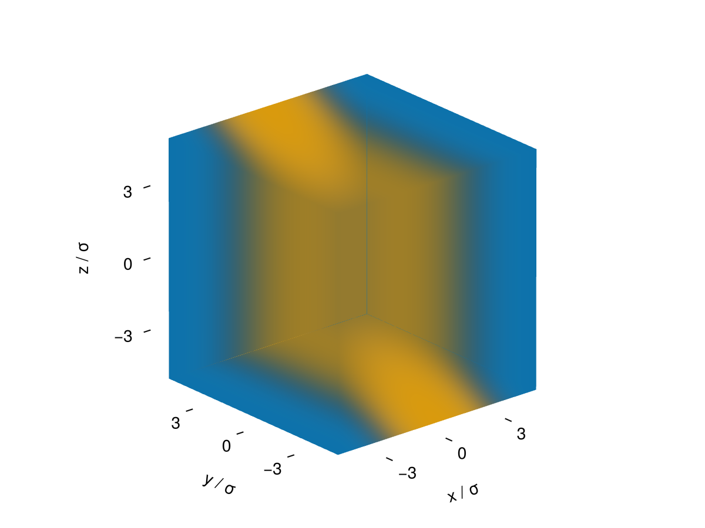
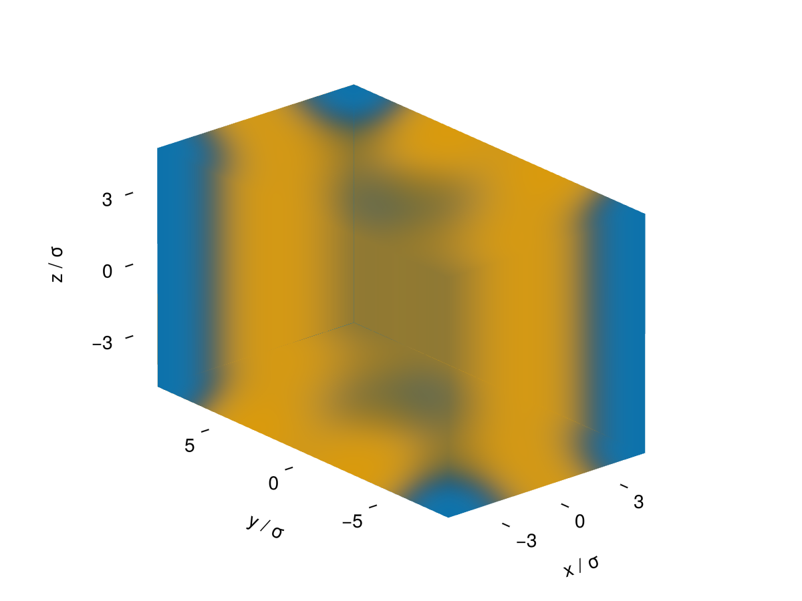
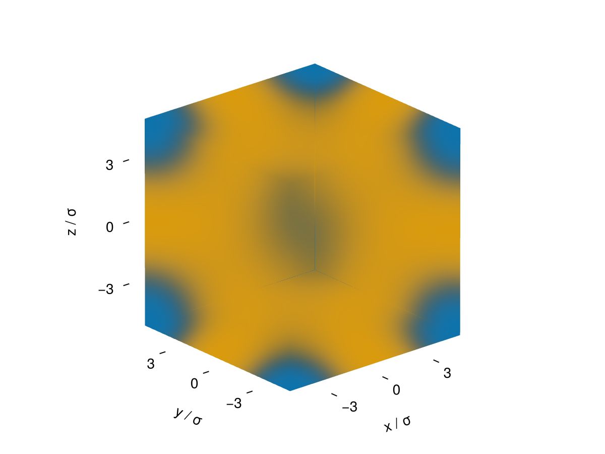
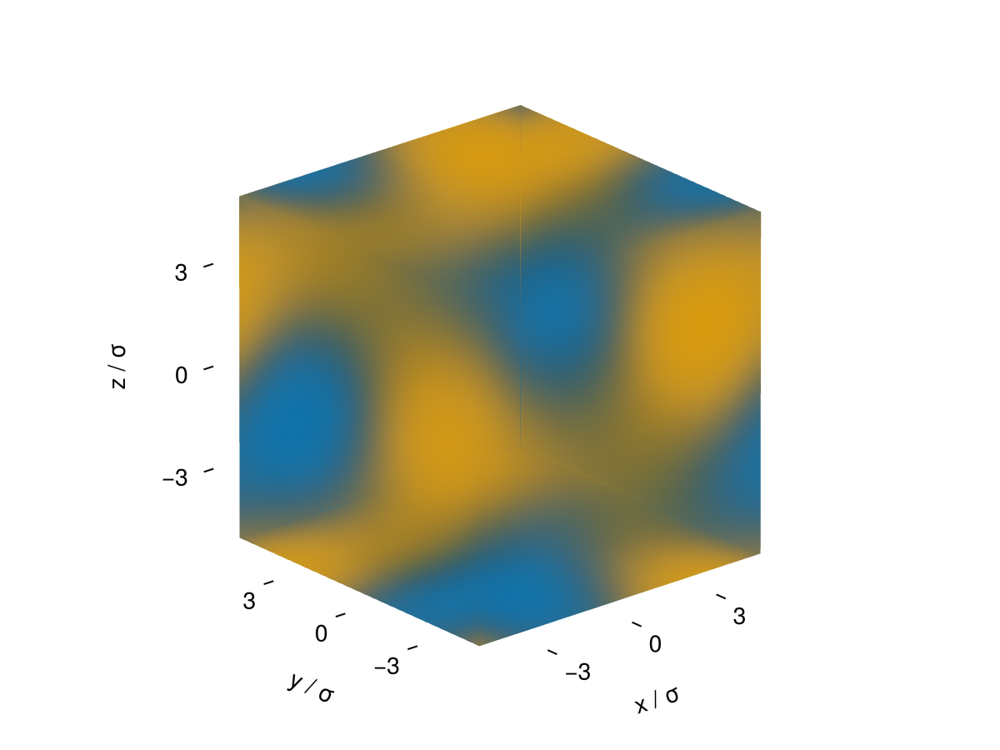

# Copolymer Microphase Morphologies

[Group-Contribution & Heterosegmented Chains](@ref) introduced
[`custom_structure`](@ref cDFT.custom_structure) for describing a synthetic block
copolymer's bead sequence (e.g. `custom_structure("AAAABBBB")` for a symmetric diblock).
This tutorial uses that same mechanism together with four new structures —
[`LamellarStack3DCart`](@ref cDFT.LamellarStack3DCart),
[`HexLattice3DCart`](@ref cDFT.HexLattice3DCart), [`BCC3DCart`](@ref cDFT.BCC3DCart) and
[`Gyroid3DCart`](@ref cDFT.Gyroid3DCart) — to seed and converge the classic
microphase-separated morphologies a diblock melt can adopt.

## Recap: `custom_structure` and group names

`custom_structure(s)` turns a string like `"AAAABBBB"` into a bead-by-bead connectivity:
each character is one bead, bonded to the previous one in sequence, so `"AAAABBBB"`
describes a linear diblock with 4 `A`-beads followed by 4 `B`-beads. Internally, cDFT
labels each expanded bead `"A_1"`, `"A_2"`, …, `"B_1"`, … — one entry per bead, with the
letter prefix identifying which named group it belongs to.

## What's new: `core_groups`

A macroscopic VLE/LLE interface (see [Vapour-Liquid Interfaces](@ref)) transitions between
two bulk densities of the *same* whole component on either side. A block copolymer melt is
different: within a *single* component, different *groups* enrich in different spatial
domains of one periodic unit cell. Each new morphology structure takes a `core_groups`
keyword — the bare letters (matching the prefixes above, e.g. `"A"`) that form the
minority/core domain (spheres for BCC, cylinders for Hex, the network for Gyroid, one set
of layers for Lamellar). Every other group in the model is treated as the surrounding
matrix.

## Building the copolymer model

Following the same pattern as `examples/dynamic_dft_3d_copolymer.jl`, define a synthetic
"mol" component with two named groups `A`/`B` and their interaction parameters (via the
existing `examples/copolymer_params_like.csv`/`copolymer_params_unlike.csv`, written for
exactly this A/B pair):

```julia
julia> using Clapeyron, cDFT

julia> model = HeterogcPCPSAFT([("mol", ["A"=>4, "B"=>4], [("A","A")=>3,("B","B")=>3,("A","B")=>1])];
                                userlocations=["copolymer_params_like.csv","copolymer_params_unlike.csv"])

julia> T, p = 298.15, 1e5

julia> v = volume(model, p, T, [1.0])

julia> ρb = [1.0]./v

julia> L = cDFT.length_scale(model)
```

The bonding topology used for the DFT calculation itself (as opposed to the bulk
thermodynamic model above) is supplied separately, via `mol_structure` — a keyword of
[`DFTSystem`](@ref cDFT.DFTSystem) (see [Group-Contribution & Heterosegmented Chains](@ref)):

```julia
julia> mol_structure = Dict("mol" => custom_structure("AAAABBBB"))
```

## Seeding and converging each morphology

Each morphology structure takes the usual `(conditions, ρbulk, bounds, ngrid)` arguments
plus `core_groups`. Build the structure, build the `DFTSystem` (passing `mol_structure`),
`initialize_profiles`, and `converge!` — exactly the same pattern as every earlier
tutorial, just with a 3D periodic unit cell and a group-resolved seed instead of a single
scalar phase.

!!! tip
    Converging a full 3D periodic multi-domain morphology is a much bigger calculation
    than the 1D examples in earlier tutorials, and the Anderson-mixing solver in
    [`converge!`](@ref cDFT.converge!) can be slower to settle for sharp, high-contrast
    seeds — the same general characteristic already noted for sharp Steele-wall profiles
    in [Choosing a Geometry & Adsorption](@ref). Expect these to take noticeably longer to
    run than earlier tutorials, and reach for [GPU Acceleration](@ref) if it becomes a
    bottleneck.

### Lamellar

```julia
julia> ngrid = 31

julia> structure = cDFT.LamellarStack3DCart((p, T), ρb, [-10L 10L; -10L 10L; -10L 10L], (ngrid, ngrid, ngrid); core_groups=["A"])

julia> system = DFTSystem(model, structure; mol_structure=mol_structure)

julia> ρ = initialize_profiles(system)

julia> converge!(system, ρ)
```



### Hexagonally-packed cylinders

`HexLattice3DCart` uses a rectangular supercell containing two cylinders, which reproduces
a true hexagonal lattice under periodic boundary conditions on a Cartesian grid — the
second `bounds` dimension should span `√3×` the first:

```julia
julia> Lx = 10L

julia> bounds = [-Lx Lx; -sqrt(3)*Lx sqrt(3)*Lx; -Lx Lx]

julia> structure = cDFT.HexLattice3DCart((p, T), ρb, bounds, (ngrid, round(Int, ngrid*sqrt(3)), ngrid); core_groups=["A"])

julia> system = DFTSystem(model, structure; mol_structure=mol_structure)

julia> ρ = initialize_profiles(system)

julia> converge!(system, ρ)
```



### BCC spheres

`BCC3DCart` expects a cubic unit cell:

```julia
julia> structure = cDFT.BCC3DCart((p, T), ρb, [-10L 10L; -10L 10L; -10L 10L], (ngrid, ngrid, ngrid); core_groups=["A"])

julia> system = DFTSystem(model, structure; mol_structure=mol_structure)

julia> ρ = initialize_profiles(system)

julia> converge!(system, ρ)
```



### Gyroid

Also a cubic unit cell, seeded from the standard Schoen gyroid level-set:

```julia
julia> structure = cDFT.Gyroid3DCart((p, T), ρb, [-10L 10L; -10L 10L; -10L 10L], (ngrid, ngrid, ngrid); core_groups=["A"])

julia> system = DFTSystem(model, structure; mol_structure=mol_structure)

julia> ρ = initialize_profiles(system)

julia> converge!(system, ρ)
```



## Next steps

These structures only seed and converge a *static* profile at the box size you choose —
they don't search for the equilibrium domain spacing itself (that would require sweeping
the box size, or letting the pattern emerge dynamically). For the latter, starting from a
near-uniform profile and letting the microphase pattern emerge on its own under
[Dynamic DFT](@ref) is often more robust than assuming a symmetry up front.
