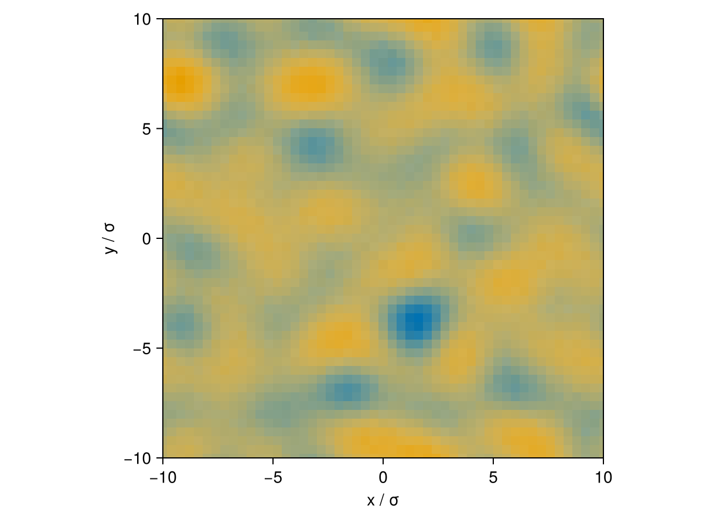
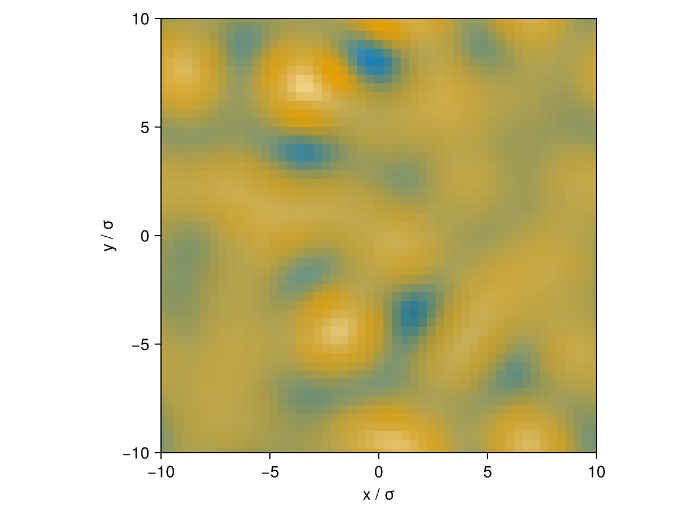
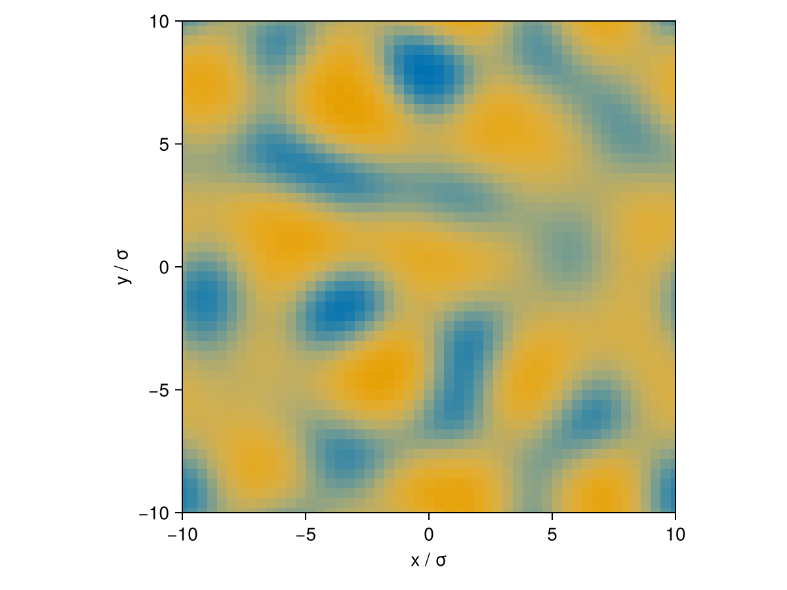

# Dynamic DFT

Every tutorial so far has solved for an *equilibrium* density profile. Dynamic DFT (DDFT)
instead evolves a density profile forward in time under diffusive dynamics driven by
gradients in the residual chemical potential — useful for watching a metastable or
unstable mixture actually phase-separate, rather than just computing its final state.

This is provided as a package extension: loading `SciMLBase` (and an ODE solver) adds an
`ODEProblem(system, ρ, tspan)` method that builds the DDFT right-hand side automatically.

## Setting up a phase-separating mixture

Take a binary mixture inside its liquid-liquid miscibility gap — the average of the two
coexisting bulk densities is thermodynamically unstable, so it will spontaneously
phase-separate once perturbed:

```julia
julia> using Clapeyron, cDFT, SciMLBase, OrdinaryDiffEqStabilizedRK, DiffEqCallbacks

julia> model = PCSAFT(["acetone", "hexane"])

julia> p, T = 1e5, 290.15

julia> x, n, _ = tp_flash(model, p, T, [0.5, 0.5], MichelsenTPFlash(equilibrium=:lle, K0=[100.0, 0.001]))

julia> ρ1, ρ2 = x[1,:]./volume(model, p, T, x[1,:]), x[2,:]./volume(model, p, T, x[2,:])

julia> ρb = (ρ1 .+ ρ2) ./ 2  # inside the miscibility gap

julia> L = cDFT.length_scale(model)

julia> ngrid = 101

julia> structure = cDFT.Uniform2DCart((p, T), ρb, [-20L 20L; -20L 20L], (ngrid, ngrid))

julia> system = DFTSystem(model, structure)

julia> ρ0 = initialize_profiles(system)
```

`initialize_profiles` returns the (stable) uniform bulk density — since spinodal
decomposition needs a perturbation to grow from, seed it with the `noise` keyword, which
multiplies each grid point/bead by an independent `1 + noise*U(-1,1)` factor:

```julia
julia> ρ0 = initialize_profiles(system; noise=0.01)
```

## Evolving in time

```julia
julia> prob = ODEProblem(system, ρ0, (0.0, 1e4))

julia> positivity_callback = FunctionCallingCallback(func_everystep=true) do ρ, t, integrator
           clamp!(ρ, 1e-12, Inf)
       end

julia> sol = solve(prob, ROCK2(); callback=positivity_callback, progress=true)
```

The state carried by `sol` is `η = log(ρ)`, not `ρ` directly (this keeps the density
strictly positive during integration) — recover the density field at any saved time point
with `exp.(sol[i])`.

```julia
julia> using CairoMakie

julia> fig_early = plot(system, exp.(sol(sol.t[1] + 0.05*(sol.t[end]-sol.t[1]))))

julia> fig_mid   = plot(system, exp.(sol(sol.t[1] + 0.3*(sol.t[end]-sol.t[1]))))

julia> fig_late  = plot(system, exp.(sol[end]))
```

```@raw html
<div style="display:flex; gap:1em; flex-wrap:wrap;">
  
  
  
</div>
```

Early on, small-scale composition fluctuations grow; at later times they coarsen into
larger domains as the system approaches its final phase-separated state.

## Next steps

See [GPU Acceleration](@ref) — DDFT on a 2D/3D grid is one of the situations where moving
`system.options.device` to a `CUDABackend()` tends to pay off, since the same convolution
is repeated at every one of potentially thousands of time steps.
