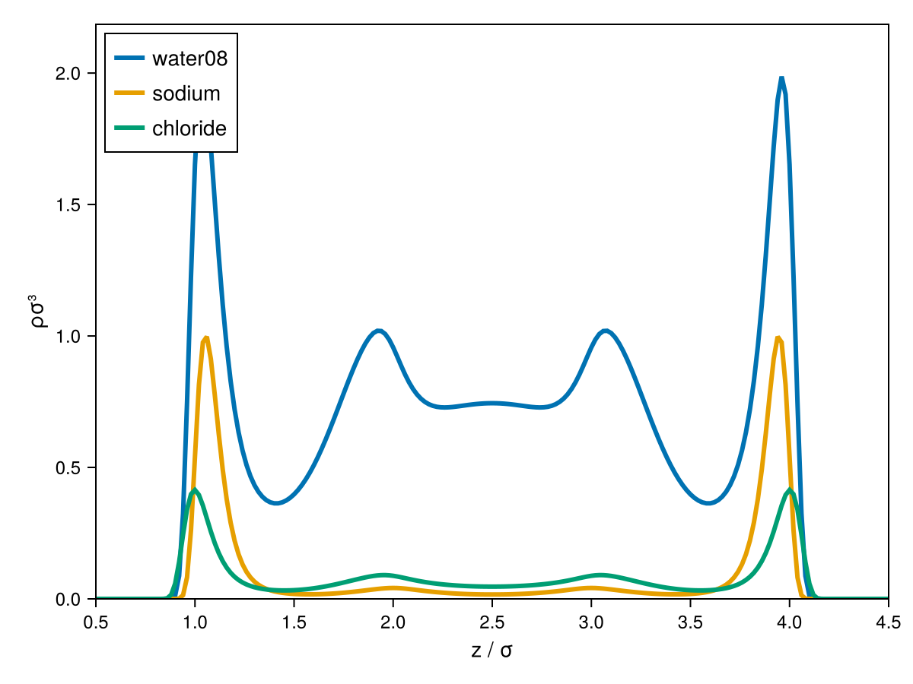

# Electrolytes

Electrolyte solutions add long-ranged electrostatics on top of the short-ranged
interactions already covered — cDFT models this with an
[`ElectrolyteDFTSystem`](@ref cDFT.ElectrolyteDFTSystem) rather than a plain
[`DFTSystem`](@ref cDFT.DFTSystem). See [Electrolytes](../models/electrolytes.md) under
**Available Models** for how the pieces (neutral model, ion model, electrostatic field)
fit together.

## Building an electrolyte model

The bulk electrolyte equation of state itself comes from Clapeyron, combining a neutral
model (e.g. `pharmaPCSAFT`, used internally by `ePCSAFT`) with an ion model (here,
[`DH`](@ref cDFT.DH), the Debye-Hückel correction) and a set of ion charges:

```julia
julia> using Clapeyron, cDFT

julia> model = ePCSAFT(["water08"], ["sodium", "chloride"])
```

!!! note
    Some ion combinations may need a parameter override to match experimental data — check
    Clapeyron's electrolyte parameter database (`model.neutralmodel.params`) if results for
    a particular salt look off relative to literature.

## Ion density profiles near a charged wall

An `ElectrolyteDFTSystem` is built the same way as a plain `DFTSystem` — pass the
electrolyte `model`, a `structure`, and (optionally) a neutral-fluid external field such as
a [`Steele`](@ref cDFT.Steele) wall. The mean-field [`ElectrostaticPotential`](@ref
cDFT.ElectrostaticPotential) is attached automatically, so you don't need to construct it
yourself:

```julia
julia> T, p = 298.15, 1e7

julia> x = [0.9, 0.05, 0.05]  # water, Na+, Cl-

julia> v = Clapeyron.volume(model.neutralmodel, p, T, x)

julia> ρbulk = x ./ v

julia> L = cDFT.length_scale(model.neutralmodel)

julia> structure = Uniform1DCyl((p, T), ρbulk, [0.0, 20L], 151)

julia> system = cDFT.ElectrolyteDFTSystem(model, structure)

julia> ρ = initialize_profiles(system)

julia> converge!(system, ρ)
```

`ρ` now contains one density field per neutral-model bead plus one per ion — the ion
fields are appended after the neutral fields (see [`ElectrolyteDFTSystem`](@ref
cDFT.ElectrolyteDFTSystem) in the API reference for the exact field layout).

```julia
julia> using CairoMakie

julia> fig = plot(system, ρ)
```



Near an attractive/repulsive wall you should see the classic electric-double-layer
structure: counter-ions enriched and co-ions depleted close to the surface, decaying to
the bulk composition `x` far away.

!!! tip
    Radial (`Sphr`/`Cyl`) structures for electrolytes need their aperture chosen with more
    care than the neutral case: the Coulomb kernel is long-ranged in real space (it diverges
    at small wavenumber), so accuracy is governed more by the QDHT aperture (`ub` in
    `bounds`) than by the number of grid points — too large an aperture under-resolves the
    short-range ion-size features and can fail outright.
