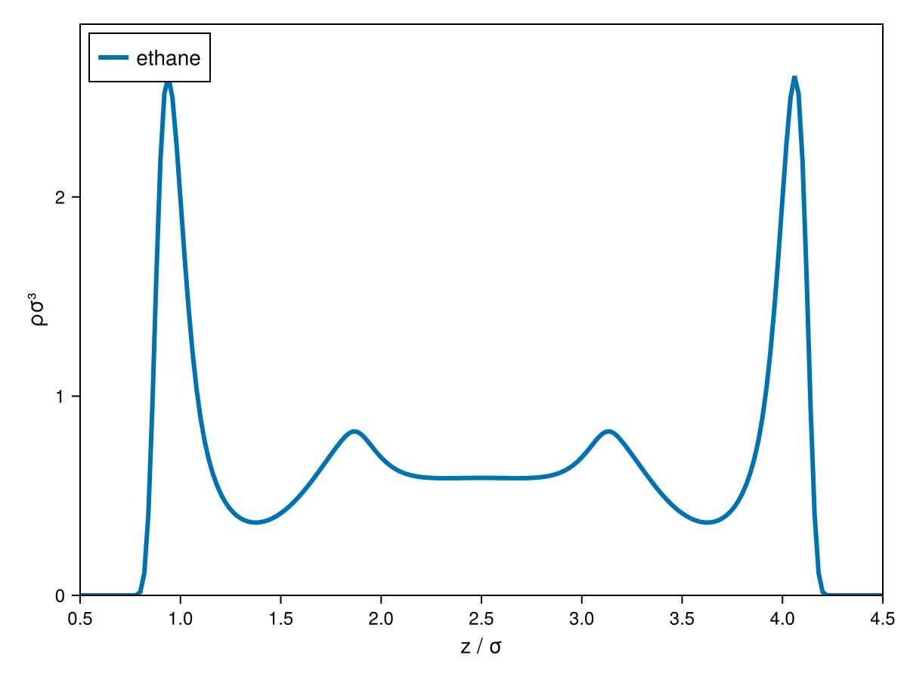
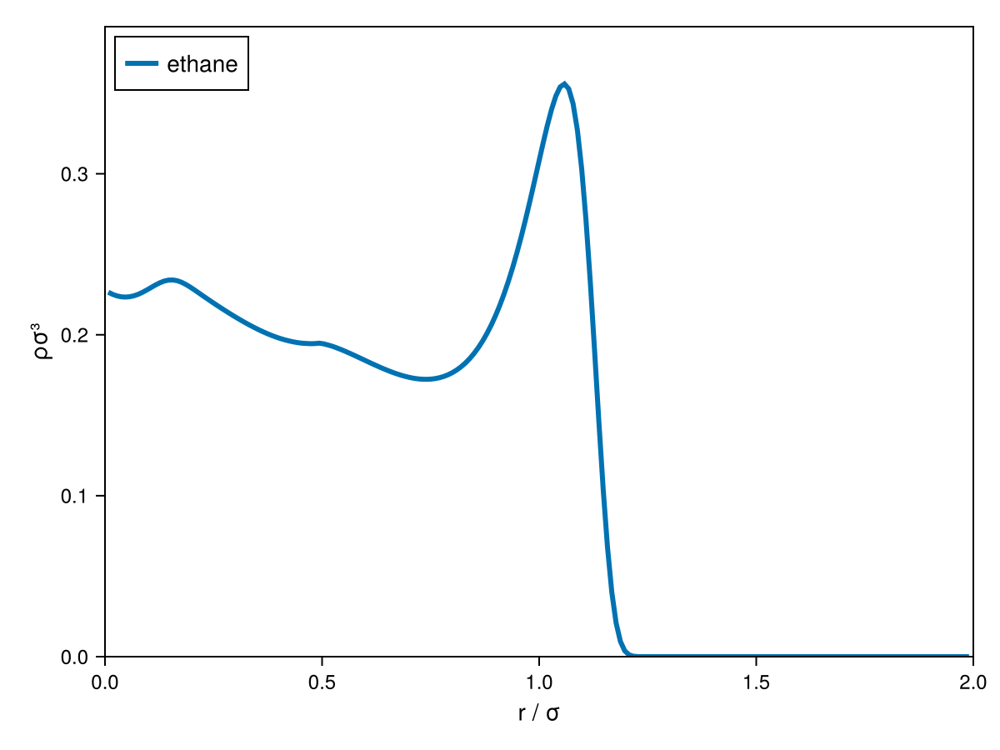
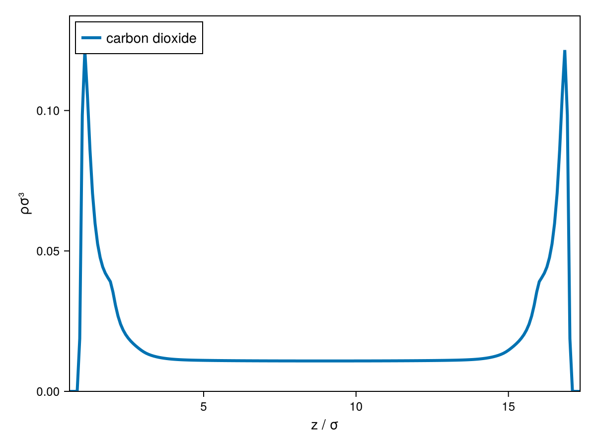
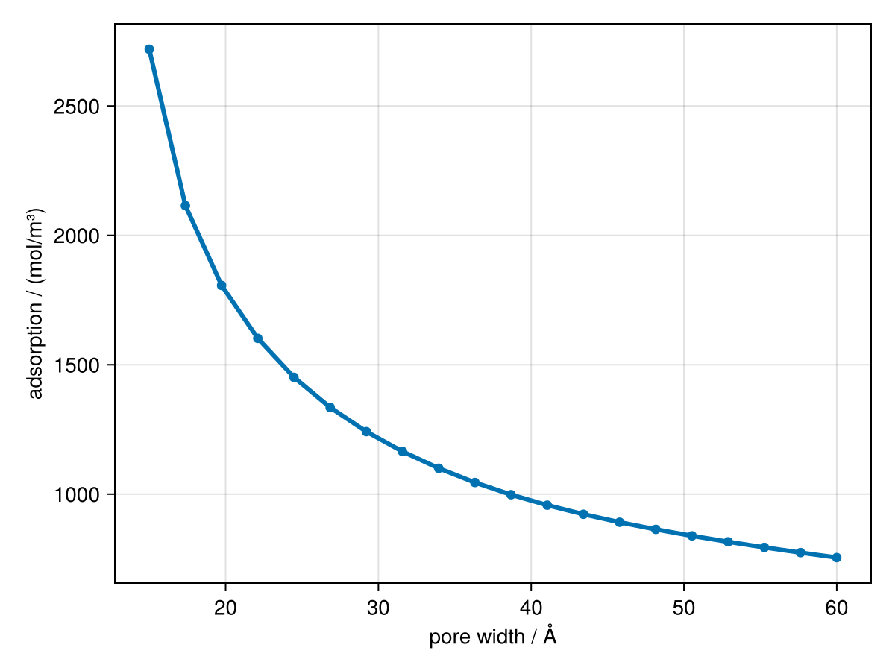
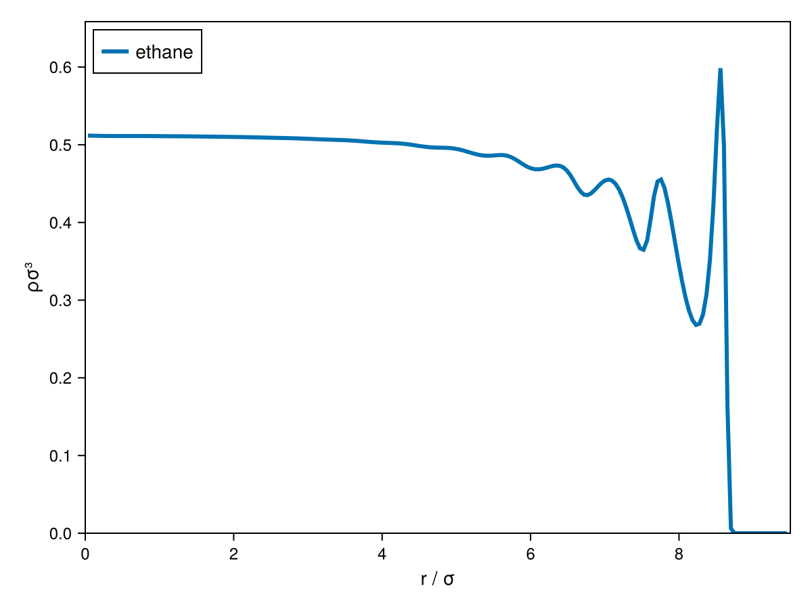

# Choosing a Geometry & Adsorption

cDFT structures fall into two groups: **single-phase** structures (a bulk fluid, typically
next to an external field) and **two-phase/interface** structures (a sigmoidal profile
between two bulk densities, used for VLE/LLE interfaces or microphase-separated
copolymers). Full type-by-type reference is on the [Structures](@ref) page; this tutorial
is about *which one to reach for*, and builds up to computing adsorption at both planar
and curved surfaces.

## Single-phase structures

| Type | Use it for |
|:-----|:-----------|
| [`Uniform1DCart`](@ref cDFT.Uniform1DCart) / [`ExternalField1DCart`](@ref cDFT.ExternalField1DCart) | A fluid next to a flat wall or in a slit pore — see [Getting Started](@ref) and the adsorption section below. |
| [`Uniform1DCyl`](@ref cDFT.Uniform1DCyl) | A fluid inside a cylindrical pore, or outside a cylindrical particle/nanotube — see the cylindrical confinement section below. |
| [`Uniform1DSphr`](@ref cDFT.Uniform1DSphr) | A fluid inside a spherical pore, or outside a spherical nanoparticle — same `bounds=[lb,ub]` idea as `Uniform1DCyl`. |
| [`Uniform2DCart`](@ref cDFT.Uniform2DCart) / [`Uniform3DCart`](@ref cDFT.Uniform3DCart) | A fluid around an arbitrary, non-symmetric object, or a periodic block-copolymer unit cell. The workhorse for [Dynamic DFT](@ref) and multi-dimensional interfaces. |

`Uniform1DSphr`/`Uniform1DCyl` use a quasi-discrete Hankel transform for radial
convolutions rather than an FFT, which is CPU-only (see the [FAQ](@ref)) — if you need a
curved geometry on the GPU, use one of the 3D Cartesian two-phase structures below instead,
which embed a sphere/cylinder in a Cartesian box.

## Two-phase / interface structures

| Type | Use it for |
|:-----|:-----------|
| [`TwoPhase1DCart`](@ref cDFT.TwoPhase1DCart) | A planar VLE or LLE interface — see [Vapour-Liquid Interfaces](@ref). |
| [`TwoPhase2DLamCart`](@ref cDFT.TwoPhase2DLamCart) / [`TwoPhase3DLamCart`](@ref cDFT.TwoPhase3DLamCart) | A lamellar (planar-stripe) a slab interface with a second/third periodic dimension. |
| [`TwoPhase2DHexCart`](@ref cDFT.TwoPhase2DHexCart) / [`TwoPhase3DHexCart`](@ref cDFT.TwoPhase3DHexCart) | A hexagonally-packed cylindrical two-phase domain, viewed end-on (2D) or extruded (3D). |
| [`TwoPhase3DSphrCart`](@ref cDFT.TwoPhase3DSphrCart) | A spherical droplet or bubble embedded in a 3D box — a GPU-compatible alternative to `Uniform1DSphr` for a symmetric interface. |

See [Copolymer Microphase Morphologies](@ref), respectively. for worked examples of the lamellar/hexagonal/spherical two-phase structures.

## Comparing planar and cylindrical confinement

The same fluid (ethane) and wall material (graphite, via [`Steele`](@ref cDFT.Steele))
confined by a flat wall and by a cylindrical pore, at the same temperature and pressure,
illustrates how curvature changes the packing structure near the surface:

```@raw html
<div style="display:flex; gap:1em; flex-wrap:wrap;">
  
  
</div>
```

Curvature suppresses the oscillatory layering seen in the planar case, because there is
less space for a fluid layer to pack into as the pore shrinks in radius. The same idea
extends to spherical confinement (`Uniform1DSphr`) and to *outside* a particle/nanotube
rather than inside a pore (by setting `bounds=[lb,ub]` with `lb>0` instead of `lb=0`) —
see the cylindrical example worked through below.

## Adsorption at a planar wall

For the common case of a single-component fluid at a slit pore formed by a [`Steele`](@ref
cDFT.Steele) wall, [`adsorption`](@ref cDFT.adsorption) does everything in one call — build
the structure, converge it, and integrate the excess density:

```julia
julia> using Clapeyron, cDFT

julia> model = PCSAFT(["carbon dioxide"])

julia> width = 50e-10  # 50 Å slit-pore separation

julia> surface = Steele(["graphite"], width)

julia> p, T = 1e6, 298.15

julia> adsorption(model, surface, p, T)
```

To see the actual density profile inside the pore (not just the integrated adsorption),
build the [`Uniform1DCart`](@ref cDFT.Uniform1DCart) structure explicitly, spanning from
one wall to the other:

```julia
julia> L = cDFT.length_scale(model)

julia> v = Clapeyron.volume(model, p, T, [1.0])

julia> ρbulk = [1/v]

julia> structure = Uniform1DCart((p, T), ρbulk, [0.6L, width - 0.6L], 201)

julia> system = DFTSystem(model, structure, surface)

julia> ρ = initialize_profiles(system)

julia> converge!(system, ρ)
```

```julia
julia> using CairoMakie

julia> fig = plot(system, ρ)

julia> save("slit_pore_profile.png", fig)
```



The profile is symmetric about the pore centre, with the same near-wall layering seen at a
single wall on each side. Sweeping the pore width with the convenience `adsorption`
function gives an adsorption isotherm without having to manage the structure/system
objects directly:

```julia
julia> widths = range(15e-10, 60e-10, length=20)

julia> ads = [adsorption(model, Steele(["graphite"], w), p, T)[1] for w in widths]
```



## Cylindrical confinement: adsorption inside a pore

Curved surfaces use [`Uniform1DCyl`](@ref cDFT.Uniform1DCyl) (or
[`Uniform1DSphr`](@ref cDFT.Uniform1DSphr)) in place of the planar `z` coordinate above,
with the radial coordinate `r`. `bounds = [lb, ub]` again has a dual role: `ub` sets the
aperture of the underlying radial (Hankel) transform, while `lb` places an
excluded-volume/wall boundary — so the same type covers both "fluid inside a pore"
(`lb = 0`, shown here) and "fluid outside a particle/nanotube" (`lb > 0`) just by choosing
where the wall sits.

```julia
julia> model = PCSAFT(["ethane"])

julia> T, p = 298.0, 1e7

julia> v = Clapeyron.volume(model, p, T, [1.0]; phase=:liquid)

julia> ρbulk = [1/v]

julia> L = cDFT.length_scale(model)

julia> width = 10L

julia> surface = Steele(["graphite"], width)

julia> structure_in = Uniform1DCyl((p, T), ρbulk, [0.0, width - 0.5L], 201)

julia> system_in = DFTSystem(model, structure_in, surface)

julia> ρ_in = initialize_profiles(system_in)

julia> converge!(system_in, ρ_in)
```

```julia
julia> using CairoMakie

julia> fig = plot(system_in, ρ_in)
```



!!! tip
    At near-wall densities like this one, the Anderson-mixing solver in [`converge!`](@ref cDFT.converge!) can occasionally diverge for sharp Steele-wall profiles — this is a general characteristic of the solver, not specific to curved     coordinates.
    If it happens, try a lower pressure, a less attractive surface, or more grid points.
