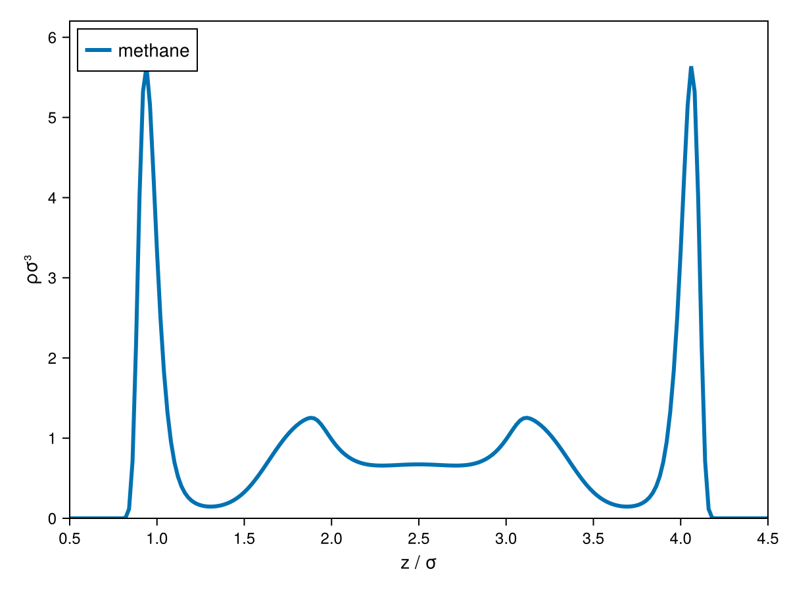

# Getting Started

Every cDFT calculation is built from the same four ingredients:

1. A bulk **`model`** — a Clapeyron equation of state (e.g. `PCSAFT`).
2. A **`structure`** — the geometry, grid and conditions the density profile lives on
   (see [Choosing a Geometry & Adsorption](@ref)).
3. Optionally, one or more **external fields** — a wall, a solute, a charged surface (see
   [External Fields](@ref)).
4. **`options`** — device (CPU/GPU) and solver settings (see [`DFTOptions`](@ref cDFT.DFTOptions)).

These compose into a [`DFTSystem`](@ref cDFT.DFTSystem), which [`converge!`](@ref cDFT.converge!)
solves in place for the equilibrium density profile.

## A fluid next to a wall

Let's compute the density profile of liquid methane next to a graphite wall, using the
[`Steele`](@ref cDFT.Steele) 9-3 potential.

```julia
julia> using Clapeyron, cDFT

julia> model = PCSAFT(["methane"])
PCSAFT{BasicIdeal} with 1 component:
 "methane"
Contains parameters: Mw, segment, sigma, epsilon

julia> T, p = 150.0, 1e7  # a subcritical liquid (Tc ≈ 190 K)

julia> v = Clapeyron.volume(model, p, T, [1.0]; phase=:liquid)

julia> ρbulk = [1/v]

julia> L = cDFT.length_scale(model)  # a characteristic length (≈ σ) for choosing grid bounds
```

Build the walls, then a 1D Cartesian structure:

```julia
julia> width = 5L

julia> surface = Steele(["graphite"], width)

julia> structure = Uniform1DCart((p, T), ρbulk, [0.5L, width-0.5L], 201)
```

Compose the system and converge it:

```julia
julia> system = DFTSystem(model, structure, surface)

julia> ρ = initialize_profiles(system)

julia> converge!(system, ρ)
```

`ρ` is now the converged density profile, indexed `ρ[i, k]` for grid point `i` and bead `k`
(a single-bead model like `PCSAFT` methane has only `k = 1`). Plotting it with the built-in
Makie recipe:

```julia
julia> using CairoMakie

julia> fig = plot(system, ρ)

julia> save("density_profile.png", fig)
```



The profile should show the familiar layering oscillations near the wall, decaying to the
bulk density `ρbulk[1]` far from it.

## Next steps

- [Choosing a Geometry & Adsorption](@ref) surveys the other structure types (curved
  surfaces, 2D/3D boxes, interfaces) and builds on this exact setup to compute adsorption
  isotherms at planar and curved surfaces.
- [`adsorption(model, surface, p, T, n)`](@ref cDFT.adsorption) is a convenience wrapper
  that does all of the above in one call for the common case of a single planar wall.
