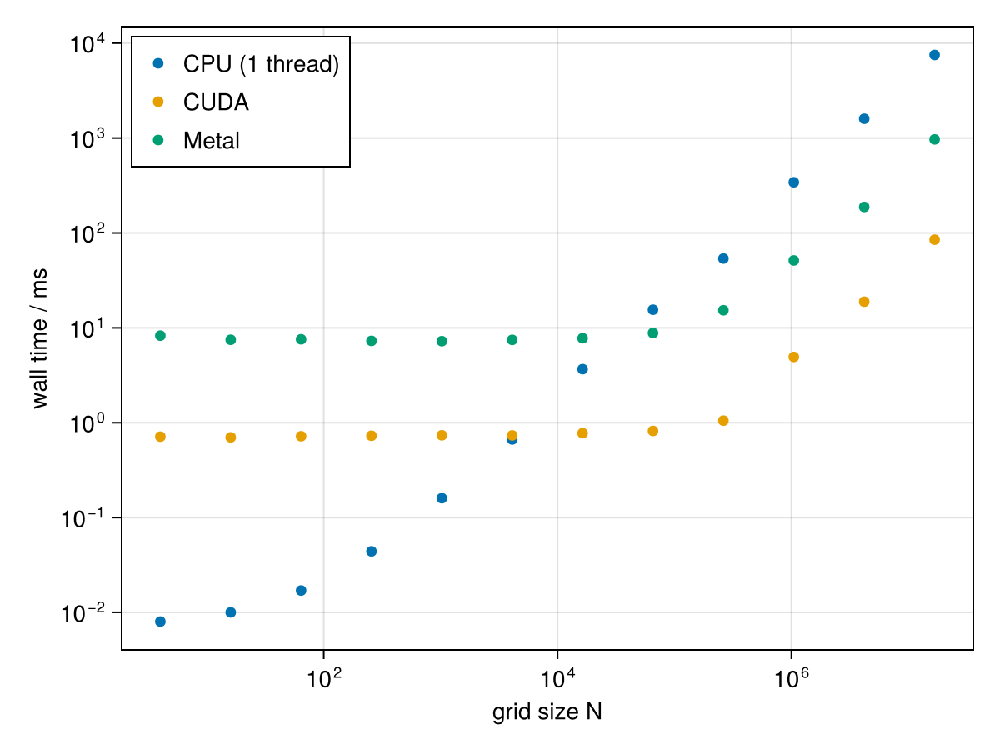
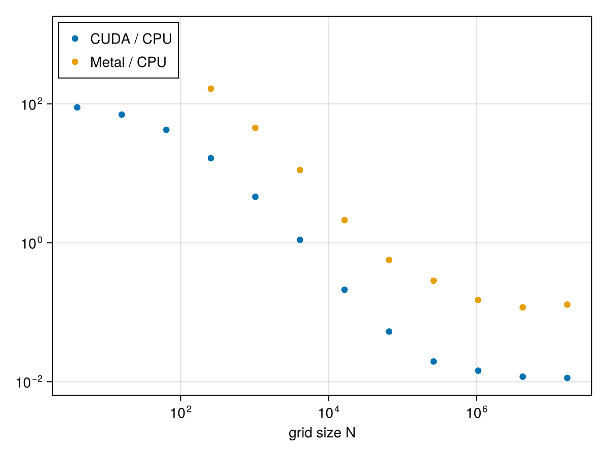

# GPU Acceleration

Every free-energy kernel in cDFT is written using
[KernelAbstractions.jl](https://github.com/JuliaGPU/KernelAbstractions.jl) and
differentiated with [Enzyme.jl](https://github.com/EnzymeAD/Enzyme.jl), so the same model
code runs unchanged on CPU or GPU (CUDA or Metal) — which device is used is purely a property of
[`DFTOptions`](@ref cDFT.DFTOptions).

!!! note
    Spherical/cylindrical (`Uniform1DSphr`/`Uniform1DCyl`) structures are CPU-only (see the
    [FAQ](@ref)) — GPU acceleration applies to Cartesian structures (`Uniform2DCart`,
    `Uniform3DCart`, and the 2D/3D two-phase structures).

## Selecting a device

Load `CUDA` / `Metal`  *before* building your `DFTOptions`, then pass a `CUDABackend()` / `MetalBackend()`:

```julia
julia> using Clapeyron, cDFT, CUDA

julia> options = DFTOptions(CUDABackend())

julia> system = DFTSystem(model, structure, options)
```

Everything downstream (`initialize_profiles`, `converge!`, the DDFT `ODEProblem` from
[Dynamic DFT](@ref)) then runs on the GPU automatically — `ρ` itself becomes a `CuArray`.

For pinned multi-threaded CPU runs instead (via the `ThreadPinning` extension):

```julia
julia> using ThreadPinning

julia> options = DFTOptions(CPU(4, [0, 1, 12, 13]))  # 4 threads, pinned to these core IDs
```

## When it's worth it

GPU transfer and kernel-launch overhead means the GPU only wins once there's enough work
per convolution to amortise it — in practice, that means large 2D/3D grids, or any
calculation (like [Dynamic DFT](@ref)) that repeats the same convolution over many
iterations/time steps. For small 1D structures, the CPU is typically faster once you
account for transfer overhead.





As can be seen above, the switch to GPU backends only become worthwhile above $10^4\sim 10^5$ grid points.

## Precision

`DFTOptions` also controls the floating-point precision used throughout the calculation,
independent of the device:

```julia
julia> options = DFTOptions(CUDABackend(); precision = Float32)
```

`Float32` roughly halves memory bandwidth and can meaningfully speed up GPU runs, at the
cost of solver precision — worth trying if you're memory-bandwidth-bound on very large 3D
grids, but check convergence tolerances still make sense at reduced precision.

!!! tip
    Metal GPUs are only compatible with Float32 precision. Once `Metal` is loaded, `cDFT` will automatically update the precision.
