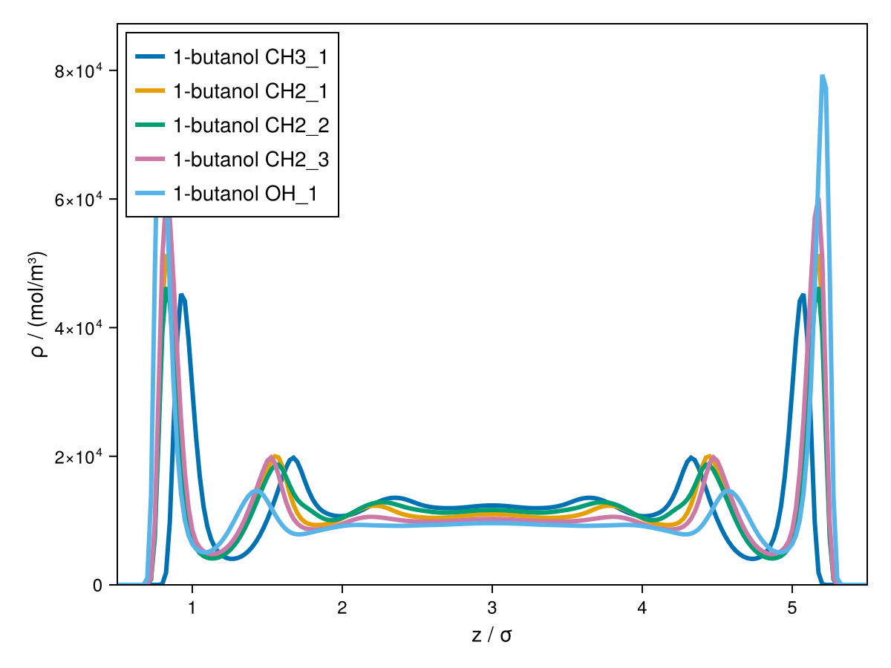

# Group-Contribution & Heterosegmented Chains

The models covered so far ([`PCSAFT`](@ref cDFT.PCSAFT), etc.) treat each molecule as a
single effective bead. [`HeterogcPCPSAFT`](@ref cDFT.HeterogcPCPSAFT) instead resolves a
molecule's actual group topology — each functional group is its own bead, bonded together
via a chain propagator — which matters when the *shape* of a molecule affects how it packs
near a surface or interface (e.g. long-chain alcohols, or block copolymers).

## Automatic connectivity from a name or SMILES string

For real, identifiable molecules, cDFT can resolve the group topology automatically from
just the component name, via the `GCIdentifier`/`ChemicalIdentifiers` extension (see
[Installation](@ref) and the [FAQ](@ref)):

```julia
julia> using Clapeyron, cDFT, GCIdentifier, ChemicalIdentifiers

julia> model = HeterogcPCPSAFT(["1-butanol"])
```

This works for anything `ChemicalIdentifiers` can resolve to a SMILES string. If you'd
rather supply the SMILES directly (e.g. for a component whose name doesn't resolve
cleanly), pass a [`smiles`](@ref cDFT.smiles) via the `mol_structure` keyword — note that
`mol_structure` is a keyword of [`DFTSystem`](@ref cDFT.DFTSystem) itself, not of the model
constructor, since it controls how cDFT expands the bulk model into bonded beads for the
DFT calculation:

```julia
julia> model = HeterogcPCPSAFT(["1-butanol"])

julia> system = DFTSystem(model, structure; mol_structure = Dict("1-butanol" => smiles("CCCCO")))
```

## Custom (synthetic) structures

For pseudo-components that aren't real, identifiable molecules — most notably block
copolymers — describe the bead sequence directly with [`custom_structure`](@ref
cDFT.custom_structure). Each non-parenthesis character is one group instance, bonded to
the previous one in sequence; parentheses open/close a branch:

```julia
julia> custom_structure("AAAAABBBB")  # linear chain: 5 A-beads then 4 B-beads

julia> custom_structure("A(B)CCC")    # a B branching off the first A, then a C-C-C chain from that A
```

This is passed the same way, via `mol_structure`:

```julia
julia> system = DFTSystem(model, structure; mol_structure = Dict("mol"=>custom_structure("AAAAABBBB")))
```

## Using it in a DFT calculation

Once built, a `HeterogcPCPSAFT` model is used exactly like any other model — it just uses a
chain propagator internally, and the QDHT-based radial structures need a larger aperture
than a monomer-only system to resolve the bond length (see the [FAQ](@ref) and the note
below):

```julia
julia> model = HeterogcPCPSAFT(["1-butanol"])

julia> T = 298.15

julia> (p, vl, _) = Clapeyron.saturation_pressure(model, T)

julia> ρbulk = [1/vl]

julia> L = cDFT.length_scale(model)

julia> structure = Uniform1DCyl((p, T), ρbulk, [0.0, 60L], 151)

julia> system = DFTSystem(model, structure)

julia> ρ = initialize_profiles(system)

julia> converge!(system, ρ)
```

!!! tip
    The propagator's bond-length kernel is typically much larger than the FMT
    weighted-density half-diameters used by monomer-only models, so radial (`Sphr`/`Cyl`)
    structures need a substantially larger aperture (`ub` in `bounds`) to resolve it well —
    `60L` above, versus `10L`–`20L` for a plain `PCSAFT` fluid. Too small an aperture gives
    badly wrong results rather than an obvious error.

```julia
julia> using CairoMakie

julia> fig = plot(system, ρ)
```



## Next steps

[Multi-Dimensional Interfaces](@ref) uses `custom_structure` together
with a 2D/3D two-phase structure to build a microphase-separating diblock copolymer melt.
