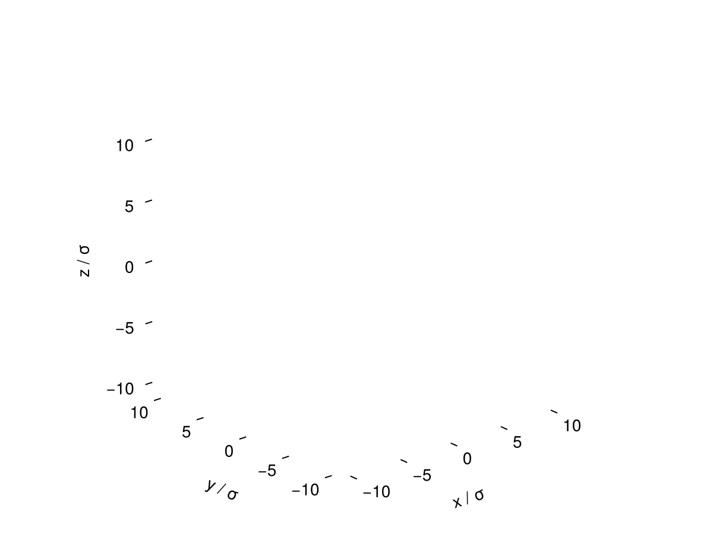

# Multi-Dimensional Interfaces

[Vapour-Liquid Interfaces](@ref) covered the simplest case: a planar interface with a
single coordinate. Real interfaces are often curved (e.g. a micelle). cDFT's
2D/3D two-phase structures (see [Choosing a Geometry & Adsorption](@ref)) cover both.

## A spherical droplet

[`TwoPhase3DSphrCart`](@ref cDFT.TwoPhase3DSphrCart) embeds a spherically-symmetric
interface in a 3D Cartesian box (GPU-compatible, unlike `Uniform1DSphr`) — the profile is
initialised as a sphere of the first phase surrounded by the second:

```julia
julia> using Clapeyron, cDFT

julia> model = PCSAFT(["water"])

julia> T = 298.15

julia> (p, vl, vv) = saturation_pressure(model, T)

julia> ρl, ρv = [1.0]./vl, [1.0]./vv

julia> L = cDFT.length_scale(model)

julia> ngrid = 51

julia> structure = cDFT.TwoPhase3DSphrCart((p, T), ρl, ρv, [-10L 10L; -10L 10L; -10L 10L], (ngrid, ngrid, ngrid))

julia> system = DFTSystem(model, structure)

julia> ρ = initialize_profiles(system)

julia> converge!(system, ρ)
```

```julia
julia> using CairoMakie

julia> fig = plot(system, ρ)

julia> save("droplet_slice.png", fig)
```



Note that `TwoPhase3DSphrCart`/`TwoPhase2DHexCart`/`TwoPhase3DHexCart` are not currently
exported (construct them with the `cDFT.` prefix as above), unlike the other structure
types.