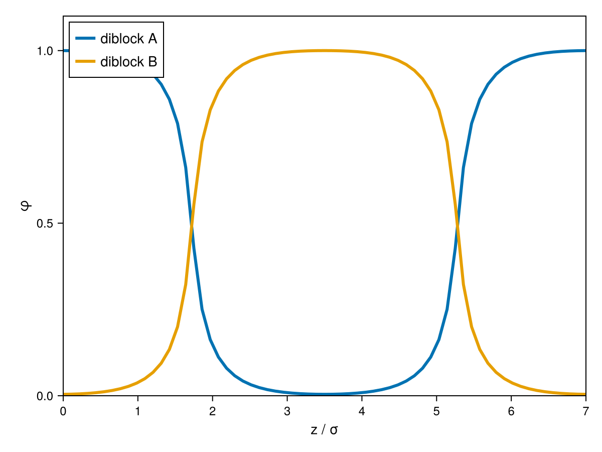

# Self-Consistent Field Theory

[Self-Consistent Field Theory (SCFT)](../models/scft.md) reaches block-copolymer
microphase morphologies via mean fields `w_α(r)` per species rather than a particle-based
free-energy functional. This tutorial builds an `SCFTSystem` for a symmetric AB diblock
melt and converges it to the classic lamellar phase — the SCFT counterpart to the
[Copolymer Microphase Morphologies](@ref "Copolymer Microphase Morphologies") tutorial's
classical-DFT route to the same physics.

## Building the lattice fluid model

`SCFTLatticeFluid` takes a list of `(name, sequence)` components — here one component
`"diblock"` made of 10 `A`-beads followed by 10 `B`-beads — a reference density per
species, and a `χ` (Flory-Huggins interaction) matrix:

```julia
julia> using cDFT

julia> N_seg = 20

julia> chi_val = 1.5

julia> chi = zeros(2, 2)

julia> chi[1, 2] = chi[2, 1] = chi_val

julia> model = SCFTLatticeFluid([("diblock", ["A"=>N_seg÷2, "B"=>N_seg÷2])], ones(2), chi;
                                 rho0=1.0, kappa=25.0)
```

`rho0` is the reference total segment density and `kappa` is the Helfand
compressibility penalty enforcing `ρ_A + ρ_B ≈ rho0` (see [Lattice Fluid
Model](@ref)).

As with the group-contribution DFT models, the chain's bonding topology is supplied
separately via `mol_structure`, using the same [`custom_structure`](@ref
cDFT.custom_structure) mechanism as [Group-Contribution & Heterosegmented Chains](@ref):

```julia
julia> mol_structure = Dict("diblock" => custom_structure("A"^(N_seg÷2) * "B"^(N_seg÷2)))
```

## Seeding a lamellar unit cell

[`LamellarStack1DCart`](@ref cDFT.LamellarStack1DCart) (see [Block-Copolymer Microphase
Morphologies](@ref)) seeds a periodic layered profile directly — a much more reliable
starting point for a symmetric diblock than random noise, which can decay back to a
uniform melt before the Anderson solver has a chance to grow the instability. `core_groups`
picks which named group (from `custom_structure`'s letter prefixes) forms the
minority/core layer:

```julia
julia> L = 7.0

julia> ngrid = 65

julia> structure = LamellarStack1DCart((0.0, 0.0), [1.0], [0.0, L], ngrid; core_groups=["A"])
```

`SCFTSystem` composes the model, structure and chain architecture, mirroring
[`DFTSystem`](@ref cDFT.DFTSystem). Because this is a melt of a single molecule type
filling the box, use the canonical ensemble with the chain count implied by the box
length and chain length:

```julia
julia> n_chains = L / N_seg

julia> system = SCFTSystem(model, structure, DFTOptions();
                            mol_structure=mol_structure,
                            ensemble=[:canonical],
                            n_molecules=[n_chains])
```

## Converging

`initialize_profiles` and `converge!` follow the same pattern as every other tutorial:

```julia
julia> ρ = initialize_profiles(system)

julia> converge!(system, ρ; verbose=true)
```

```
Converged after 53 iterations.
```

```julia
julia> plot(system, ρ)
```



The two species separate into alternating layers, each reaching a volume fraction `φ`
near `1.0` at its layer center and near `0.0` in the opposing layer — a genuine
microphase-separated lamellar melt, not the near-uniform profile a weak random seed can
get stuck at for this `χN` and mixing schedule.

## Next steps

`LamellarStack1DCart`/`HexLattice2DCart`/`HexLattice3DCart`/`BCC3DCart`/`Gyroid3DCart`
all work as `SCFTSystem` seeds the same way — see [Block-Copolymer Microphase
Morphologies](@ref) for the full structure list, and [Copolymer Microphase
Morphologies](@ref "Copolymer Microphase Morphologies") for the equivalent classical-DFT
workflow using `HeterogcPCPSAFT`/`DFTSystem` instead.
