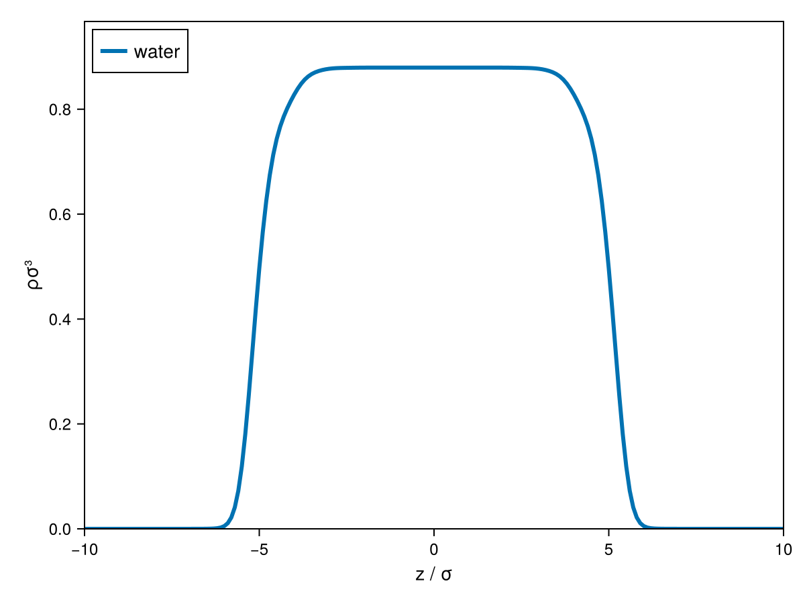

# Vapour-Liquid Interfaces

cDFT can resolve the density profile across a vapour-liquid (or liquid-liquid) interface
directly, using a [`TwoPhase1DCart`](@ref cDFT.TwoPhase1DCart) structure initialised as a
sigmoidal profile between two bulk densities, and integrate the resulting profile into a
surface or interfacial tension.

!!! note
    Both convenience functions below assume the interface is planar (1D Cartesian) and
    that the two supplied phases are genuinely in bulk equilibrium — for systems expected
    to form micelles instead of a simple interface, these aren't the right tool.

## Surface tension of a pure fluid

[`surface_tension`](@ref cDFT.surface_tension) takes a model and saturation conditions,
and handles the phase-equilibrium calculation, structure setup and convergence internally:

```julia
julia> using Clapeyron, cDFT

julia> model = PCSAFT(["ethanol", "hexane"])

julia> T = 298.15

julia> x = [0.5, 0.5]

julia> γ = surface_tension(model, T, x)
0.0198...  # N/m
```

(For a genuinely pure fluid, just pass a single-component `model` and drop `x`, which
defaults to `[1.0]`.)

## Interfacial tension between two liquid phases

For a liquid-liquid interface, [`interfacial_tension`](@ref cDFT.interfacial_tension) takes
the compositions of the two coexisting phases directly — typically obtained from a
Clapeyron `tp_flash` — rather than doing a saturation calculation itself:

```julia
julia> model = PCSAFT(["water", "hexane"])

julia> p, T = 1e5, 298.15

julia> (x, _, _) = tp_flash(model, p, T, [0.5, 0.5], RRTPFlash(equilibrium=:lle))

julia> γ = interfacial_tension(model, p, T, x[1,:], x[2,:])
0.0307...  # N/m
```

## Inspecting the density profile

Both convenience functions converge a full [`DFTSystem`](@ref cDFT.DFTSystem) internally,
but only return the scalar tension. To see the actual interfacial density profile, build
the `TwoPhase1DCart` system by hand — this is exactly what `surface_tension`/
`interfacial_tension` do under the hood:

```julia
julia> model = PCSAFT(["water"])

julia> T = 298.15

julia> (p, vl, vv) = saturation_pressure(model, T)

julia> ρ1, ρ2 = [1.0]./vl, [1.0]./vv

julia> L = cDFT.length_scale(model)

julia> structure = TwoPhase1DCart((p, T), ρ1, ρ2, [-10L, 10L], 201)

julia> system = DFTSystem(model, structure)

julia> ρ = initialize_profiles(system)

julia> converge!(system, ρ)
```

```julia
julia> using CairoMakie

julia> fig = plot(system, ρ)

julia> save("vle_profile.png", fig)
```



## Next steps

This tutorial only covers a 1D planar interface. For interfaces with additional
translationally-invariant dimensions, curved (droplet) interfaces, or microphase-separated
copolymer melts, see [Multi-Dimensional Interfaces & Copolymer Phases](@ref).
